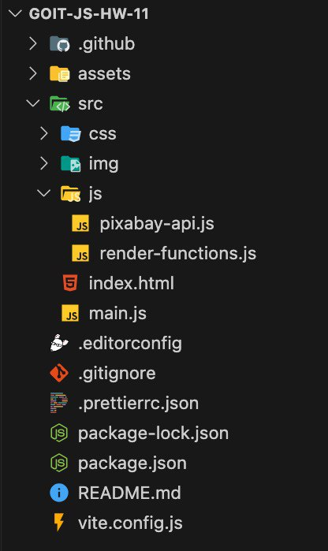

# Homework №11

1. Create a repository **`goit-js-hw-11`**.
2. Build the project using [**Vite**](https://vite.dev/). We prepared a
   [ready-made template](https://github.com/goitacademy/vanilla-app-template)
   with all the additional project settings and recommend using it.
3. Use [**Axios**](https://axios-http.com/) for HTTP requests.
4. Read the task and implement it in your code editor.
5. Make sure the code is formatted with **Prettier**, and there are no errors or
   warnings in the console when opening the live page.
6. Submit the homework for review.

**Submission format:** The homework should contain two links: to the source
files and to the live page on **GitHub Pages**.



---

## Project structure and code organization

- File and folder names, as well as their structure, must match the given
  scheme. Otherwise, the work will not be accepted.
- Use **modularity** and the `export/import` syntax.

### `pixabay-api.js`

Store functions for making HTTP requests here:

- **getImagesByQuery(query)**
  - Accepts one parameter `query` (search term as a string).
  - Makes an HTTP request and returns the value of the `data` property from the
    response.

### `render-functions.js`

Here:

- Create an instance of **SimpleLightbox** for the modal window.
- Store functions for updating UI elements:
  - **createGallery(images)** – accepts an array of `images`, creates HTML
    markup for the gallery, adds it to the container, and calls the `refresh()`
    method of the **SimpleLightbox** instance. Returns `void`.
  - **clearGallery()** – clears the gallery container. Returns `void`.
  - **showLoader()** – adds a class to display the loader. Returns `void`.
  - **hideLoader()** – removes the loader class. Returns `void`.

### `main.js`

- Contains the entire application logic.
- Calls **iziToast** and performs array length checks from the API response
  here.
- Import functions from `pixabay-api.js` and `render-functions.js` and call them
  at the appropriate moment.

## 🎥 Demo video

https://github.com/user-attachments/assets/a0e035cf-3707-481f-af58-d96f51551eed

---

## Task — Image Search

Create an application to search for images by keyword and display them in a
gallery. Style the UI elements according to the
[design mockup](https://www.figma.com/file/m8k9NQV7qZrtYDCvxfD68B/%D0%94%D0%97-JavaScript?type=design&node-id=3-1009&mode=design&t=eCh8cUwdfWOakuAr-0).

---

### Search Form

Add the following HTML markup for the form. The form consists of an input field
for the search term and a **submit** button.

```html
<form class="form">
  <label>
    <input
      type="text"
      name="search-text"
      placeholder="Search images..."
      required
    />
  </label>
  <button type="submit">Search</button>
</form>
```

## Image Search by Keyword

The user will enter a search string into the text input, and after submitting
the form, an HTTP request should be made using that search string.

### Form Validation

When the form submit button is clicked, check that the input field is not empty,
so the user cannot send a request if the search field is empty.

### HTTP Requests

- Add the [**Axios**](https://axios-http.com/) library to the project for making
  HTTP requests.
- Use the public API service [**Pixabay**](https://pixabay.com/api/docs/) as the
  backend. Register, get your unique API key, and read the
  [documentation](https://pixabay.com/api/docs/#api_search_images).

#### Required query parameters:

| Parameter     | Value / Description                     |
| ------------- | --------------------------------------- |
| `key`         | Your unique API access key              |
| `q`           | The search term entered by the user     |
| `image_type`  | Image type, must be `photo`             |
| `orientation` | Photo orientation, must be `horizontal` |
| `safesearch`  | Age filter, must be `true`              |

The response will be an object with several properties, among which `hits` is an
array of objects containing images that match the search criteria.

---

### Modular Approach

Be sure to place functions for HTTP requests in a separate file
**`pixabay-api.js`** in the `js` folder. This is good practice and helps
maintain a modular approach in development.

---

### Handling Empty Results

If the backend returns an empty array, it means no suitable results were found.
In this case, display a message to the user:

`Sorry, there are no images matching your search query. Please try again!`

Use the [**iziToast**](https://github.com/marcelodolza/iziToast) library to show
notifications. To include the library's CSS in the project, add an additional
import besides what is described in the documentation:

```js
// Import as described in the documentation
import iziToast from 'izitoast';
// Additional import for styles
import 'izitoast/dist/css/iziToast.min.css';
```

Check out the
[demo video of the app](https://www.youtube.com/watch?v=4tGWr0Q7HV0&embeds_referring_euri=https%3A%2F%2Fwww.edu.goit.global%2F&embeds_referring_origin=https%3A%2F%2Fwww.edu.goit.global&source_ve_path=OTY3MTQ)
at this stage.

## Gallery and Image Cards

The gallery element (`<ul class="gallery">`) should already be present in the
HTML document. After making HTTP requests, you need to add markup for the image
cards to it.

### Image Object Structure

Each image is represented by an object, from which only the following properties
are used:

| Property        | Description                                                   |
| --------------- | ------------------------------------------------------------- |
| `webformatURL`  | URL of the small image for the gallery card                   |
| `largeImageURL` | URL of the large image for the modal window                   |
| `tags`          | String describing the image, suitable for the `alt` attribute |
| `likes`         | Number of likes                                               |
| `views`         | Number of views                                               |
| `comments`      | Number of comments                                            |
| `downloads`     | Number of downloads                                           |

---

### Clearing the Gallery

Before searching with a new keyword, the gallery content must be fully cleared
to avoid mixing results from previous queries.

---

### Demo Video

Check out the
[demo video of the app](https://www.youtube.com/watch?v=n-crt20j5I8&embeds_referring_euri=https%3A%2F%2Fwww.edu.goit.global%2F&embeds_referring_origin=https%3A%2F%2Fwww.edu.goit.global&source_ve_path=OTY3MTQ)
at this stage.

## SimpleLightbox Library

Add the ability to view large versions of images using the
[**SimpleLightbox**](https://github.com/andreknieriem/simplelightbox) library
for a full-featured gallery.

### Library Setup

To include the library’s CSS in the project, add an additional import besides
what is described in the documentation:

```js
// Import as described in the documentation
import SimpleLightbox from 'simplelightbox';
// Additional import for styles
import 'simplelightbox/dist/simple-lightbox.min.css';
```

In the markup, each image card should be wrapped in a link, as described in the
**Markup** section of the documentation. The library has a `refresh()` method,
which must be called every time new elements are added to the gallery.

The modal window functionality is tied to the gallery itself, so using
**SimpleLightbox** and its `refresh()` method is appropriate in the
`render-functions.js` file.

Check out the
[demo video of the app](https://www.youtube.com/watch?v=DVKNqtbZVGc&embeds_referring_euri=https%3A%2F%2Fwww.edu.goit.global%2F&embeds_referring_origin=https%3A%2F%2Fwww.edu.goit.global&source_ve_path=OTY3MTQ)
at this stage.

## Loading Indicator

Add an element to notify the user about the image loading process from the
backend. The loader should appear before the HTTP request starts and disappear
after it completes.

Check out the
[demo video of the app](https://www.youtube.com/watch?v=o981M1AqZ1s) at this
stage.

## Loading Indicator and Verification

Instead of plain text, as shown in the demo video, use a library with visually
appealing loading indicators:
[**css-loader**](https://github.com/vineethtrv/css-loader). A video tutorial on
using this library is available in the
[README.md](https://github.com/vineethtrv/css-loader/blob/master/README.md) of
their repository.

### Mentor Review Checklist

- The homework contains two links: to the source files and the live page on
  **GitHub Pages**.
- The project is built using [**Vite**](https://vite.dev/).
- The browser console has no errors, warnings, or console logs.
- The project includes the libraries
  [iziToast](https://github.com/marcelodolza/iziToast),
  [**SimpleLightbox**](https://github.com/andreknieriem/simplelightbox), and
  [**css-loader**](https://github.com/vineethtrv/css-loader).
- Page elements are styled according to the design layout (or custom styles).
- `pixabay-api.js` contains the `getImagesByQuery(query)` function for HTTP
  requests.
- `render-functions.js` contains a **SimpleLightbox** instance and functions for
  UI rendering: `createGallery(images)`, `clearGallery()`, `showLoader()`,
  `hideLoader()`.
- `main.js` contains all the app logic.
- The page includes a search form for images by keyword.
- On form submission, the **css-loader** loading indicator appears before the
  backend request, and previous search results are cleared.
- The form submission sends a request to the backend for images using the
  keyword and all required parameters.
- After receiving a response, the loader disappears, and images are rendered on
  the page based on the backend data, or a message is shown if no results were
  found.
- New images are added to the DOM in a single operation.
- After adding new images to the gallery, the **SimpleLightbox** instance calls
  the `refresh()` method.
- Clicking on a small image in the gallery opens its large version in a modal
  using **SimpleLightbox**.
- HTTP requests use `then()` and `catch()` handlers to manage errors and prevent
  the page from breaking.

---

**Live page: [GitHub Pages](https://akinaru72.github.io/goit-js-hw-11/)**
